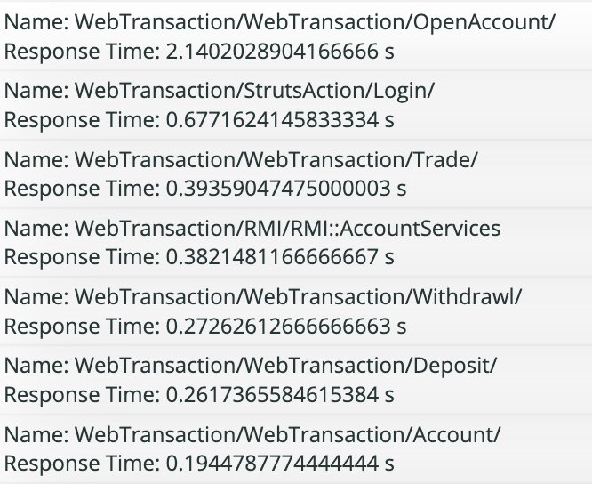

# Template String

List View uses a template string to construct each cell in the list. 


## Basics

Templates are a string of text which includes placeholders for the columns from the NRQL query. Here's an example of a NRQL query and a template string.

```
SELECT average(duration) FROM Transaction FACET name
```

```
Name: {{name}}\nResponse Time: {{duration}} s
```

List View will loop through the results of the query, and for each row, it'll output a cell in the list with the format from the template. It replaces any references in double curly braces with the value for the specified column, for that specific row.



Use `\n` to add a line break.


## Formatting

List View allows you to coerce values to certain data types, and can apply formatting to those data types. In addition to the default formatting, List View accepts additional parameters, specific for each data type, to fine tune the formatting. These additional parameters follow the column name and a pipe (`|`).

### Numbers

To coerce and format a value as a number, use the `#` sign in front of the column name within the curly brace.

For example, the value `2.1402028904166666` is formatted as `2.14`.

#### Additional Parameters

Use the following format to specify additional formatting rules.

```
[+][MINIMUM_INTEGER_DIGITS].[MINIMUM_FRACTION_DIGITS],[MAXIMUM_FRACTION_DIGITS]
```

| Example | Output | Description |
| --- | --- | --- |
| {{ # val }} | 1.234 | Default formatting  |
| {{ # val | 3 }} | 095 | Specifies the minimum digits the integer should have. This can be from 1 to 21.  |
| {{ # val | .2 }} | 1.20 | Specifies the minimum digits the fraction should have. This can be from 0 to 20.  |
| {{ # val | .0,5 }} | 2.12345 | Specifies the maximum digits the fraction should have. This can be from 0 to 20.  |
| {{ # val | + }} | +0.06 | Always displays the sign ( + or - )  |

### Dates

To coerce and format a value as a number, use the `@` sign in front of the column name within the curly brace.

The default format is the browser's default date/time display format. Here's an example in Chrome.

```
Mon Feb 21 2022 16:00:00 GMT-0800 (Pacific Standard Time)
```

#### Additional Parameters

The date format can accept a string containing tokens for various date/time parts. For example, `{{ @ val | MMM d, yyyy hh:mm tt}}` formats the date as `Feb 21, 2022 04:00 PM`.

| Token | Output | Description |
| --- | --- | --- |
| yyyy | 2021 | Four-digit year |
| yy | 21 | Two-digit year |
| MMMM | February | Full month name |
| MMM | Feb | Three-letter abbreviation for month |
| MM | 02 | Two-digit month with leading zeros for single digit months (01 - 12) |
| M | 2 | Month (1 - 12) |
| dddd | Monday | Day of week |
| ddd | Mon | Three-letter abbreviation for day of week |
| dd | 03 | Two-digit day of month with leading zeros for single digit dates (01 - 31) |
| d | 3 | Day of month (1 - 31) |
| H | 6 | Hour in 24-hour clock (0 - 23) |
| HH | 06 | Two-digit hour in 24-hour clock (00 - 23) |
| h | 9 | Hour in 12-hour clock (1 - 12) |
| hh | 09 | Two-digit hour in 12-hour clock (01 - 12) |
| m | 4 | Minute (0 - 59) |
| mm | 04 | Two-digit minute (00 - 59) |
| s | 8 | Second (0 - 59) |
| ss | 08 | Two-digit second (00 - 59) |
| sss | 450 | Three-digit millisecond (000 - 999) |
| t | A | One-character part of day |
| tt | AM | Two-character part of day |

### Sizes

List View can convert between file/memory sizes. To identify a column as a size, use the `~` sign in front of the column name within the curly brace. To convert the value, specify the size units to convert to, or the size unit in which the value is returned from the NRQL query and the desired size unit to convert to.

Most file/memory sizes are stored as bytes in New Relic by default. If a column holds values in bytes, simply specify the size unit after the pipe (`|`), like so: 

```
{{ ~ val | gb }}
```

If the size is stored in another unit (besides bytes), specify the source unit and the desired output unit separated by the greater (`>`) sign. 

```
{{ ~ val | kb > mb }}
```

#### Supported size units

| Token | Description |
| --- | --- |
| b | bytes |
| kb | kilobytes |
| mb | megabytes |
| gb | gigabytes |
| tb | terabytes |
| pb | petabytes |

### Boolean

To coerce and format a value as a boolean, use the `!` sign in front of the column name within the curly brace. For example:

```
{{ ! isResponding }}
```
